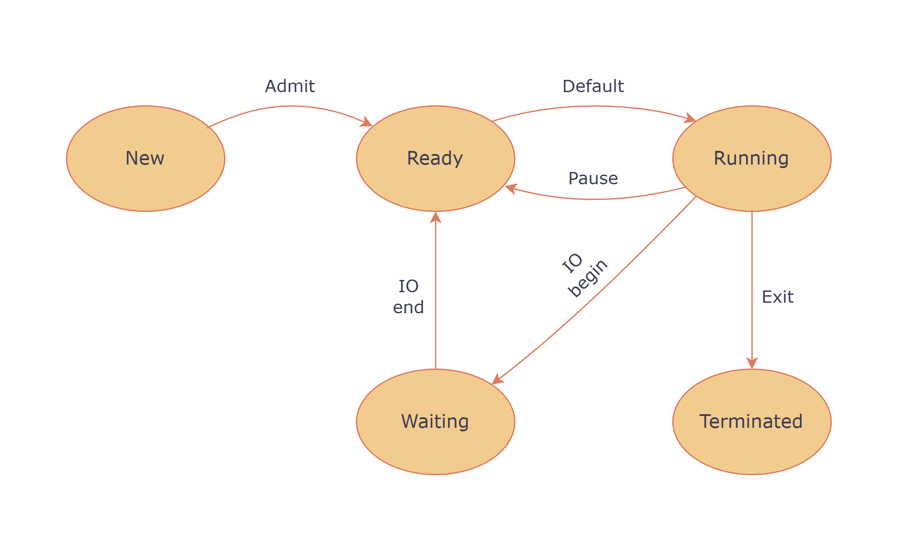
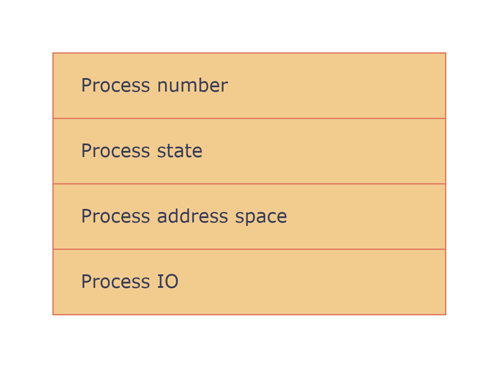

# Operating systems

# Table of contents

---

# Process management

A **program** is a set of instructions for performing a specific task. A 
program is stored on disk.  
When you start a program, you also start a process associated with it.  

## Definition of a process

A **process** is a program in execution. It requires CPU resources, memory, 
and IO.  

By organising tasks into processes, we achieve modularity. We can parallelise 
them, pause them, prioritise certain processes over others, etc.  

## Process lifecycle

  
 
- `NEW`: When a process is started, it is in the `NEW` state. The data and code associated
with the process has not yet been loaded.  
- `--> Admit`: Once the data has been loaded, transition into the `READY` state.
- `--> Dispatch`: When the process is dispatched by the **scheduler**, it transitions into
the `RUNNING` state. 
- `RUNNING`: The CPU is executing instructions associated with the process. 
Execution only happens in the `RUNNING` state.  
- `--> Pause`: Process is sent back from `RUNNING` into `READY` state. 
    - maybe yielding to another process with higher priority
    - maybe it took too long
    - maybe scheduler decided to switch to improve responsiveness
- `EXIT`: 
    - code is done 
    - process killed / aborted
    - terminated by its parent process

## Process control blocks

Each process is represented by a **process control block** (PCB). The PCB is 
stored in memory.  
  

