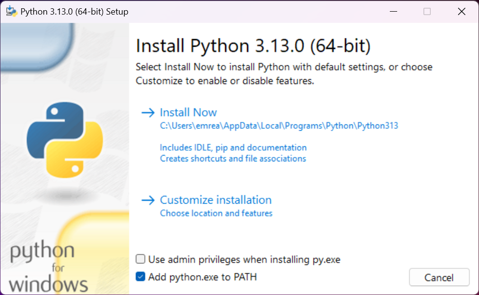
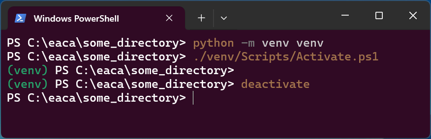

# Python

# Table of contents

- [Updating python](#updating-python) 
- [Using pip](#using-pip)
    - [Updating pip](#updating-pip)
    - [Libraries I use](#libraries-i-use)
    - [Project requirements](#project-requirements)
    - [Updating pip packages](#updating-pip-packages)
    - [Check installed packages and versions](#check-installed-packages-and-versions)
- [Virtual environments](#virtual-environments-venv)
    - [Creating a venv](#creating-a-venv)
    - [Activating a venv](#activating-a-venv)
    - [Deactivating a venv](#deactivating-a-venv)
- [Compiling a release](#compiling-a-release)
    - [Installing PyInstaller](#installing-pyinstaller)
    - [Creating a distributable](#creation-of-dist)
    
---

## Updating python
Before updating python, it is a good idea to check your current version.  
You can do this using 
```
> python --version
Python 3.12.4
```
If your install is not up to date, go to the [official python page](https://www.python.org/downloads/), and download the latest version for Windows.  
When running the installer, make sure to select the option to add python to PATH, as shown below.  

  

In the installer, you will either see an option to 'Upgrade Now' or 'Install Now'.  

### For 'Upgrade Now':

If you see the option to 'Update Now', then good news! The installer detected your old version of python, and you can select upgrade. Once you follow the instructions on the installer, go back to your terminal and check the version of python again:  

```
> python --version
Python 3.13.0 (new version)
```  

Now the update is complete! 

### For 'Install Now':
If you see the option to install instead of upgrade, that means the installer hasn't detected your old version of python. Not to worry. Simply follow the instructions in the installer. This will install the new version of python.  
At this point, if you are OK with having multiple versions of python installed on your machine at the same time, then you can log off. However, in my (limited) experience, this can create problems, such as pip linking to a specific version of python. Although these problems can be managed, we might as well avoid the problems entirely by only keeping the latest version installed, especially as backwards compatibility should'nt be a problem.  
In order to see the different versions of python installed on your machine, run  
``` 
> py --list
 -V:3.13 *        Python 3.13 (64-bit)
 -V:3.12          Python 3.12 (64-bit)
 ```  
 Here you can see that I did succesfully install 3.13, the new version, however the older version 3.12 is also installed. For reference, the asterisk indicates the default version.  
 If I now want to uninstall python3.12, I can simply do so by uninstalling it in the Windows settings, just like I would a normal program.  
 Once this has been done, you should be good to go! You can use the commands outlined earlier to check your installed version of python.  

 **Note**: after updating python, it is a good idea to also [update pip](#updating-pip). 

---

## Using pip
pip is a package manager for python. We can use it to install packages we need to use. It is a good idea to read [the section on virtual environments](#virtual-environments-venv) before installing packages using pip.

### Updating pip
You can update pip (itself) using 
```
python -m pip install --upgrade pip
```  

### Libraries I use
**Note**: it is good practice to install packages using [virtual environments](#virtual-environments-venv), instead of installing them globally.
- numpy: `python -m pip install numpy`
- pandas: `python -m pip install pandas`
- sklearn: `python -m pip install scikit-learn`
- matplotlib: `python -m pip install matplotlib`
- seaborn: `python -m pip install seaborn`
- jupyter: `python -m pip install notebook`


### Project requirements
It is common for a python project to list the pip packages it uses in a file named `requirements.txt`.  
All required packages can be installed using
```
pip install -r requirements.txt
```

### Updating pip packages

To update libraries installed using pip, use: `pip install --upgrade package_name`.

### Check installed packages and versions

To check the installed packages in your current environment, as well as their versions, use `python -m pip freeze`.

### Check a specific package
To check whether a specific package is installed (and its version), use `pip show package_name`.

---

## Virtual environments (venv)
Virtual environments, typically shortened to venvs, are an extremely useful tool in python. They allow you to install packages for one specific project without having them installed globally. They also create a recreatable and shareable environment for running your code.

### Creating a venv
In order to create a virtual environment, navigate to the directory in which you would like to have the venv, then run
```
python -m venv venv
```
 **Note:** once a venv has been created, it must be activated before it can be used.

### Activating a venv
In order to activate a venv, we must run the activate script, located in the Scripts folder.  
Since I use PowerShell on Windows, I run the Activate.ps1 script with
```
./venv/Scripts/Activate.ps1
```

This is what it should look like. The `(venv)` at the beginning of the line indicates that your virtual environment is active.  

  


If you''re using PowerShell, you might run into the error `...execution policy`.  
If that is the case, run 
```
Set-ExecutionPolicy -ExecutionPolicy RemoteSigned -Scope CurrentUser
```


### Deactivating a venv
You can deactivate a venv with 
```
deactivate
```

---

## Compiling a release

### Installing PyInstaller
We can "compile" our python file into a system binary (.exe file) to publish as a distributable release.  
In order to do this, we need the pyinstaller library.  
To check whether it is already installed, use 
```
pip show pyinstaller
```
If it is installed, you should see:
```
> Name: pyinstaller
> Version: 6.11.0
> ...
```
Otherwise, install it using
```
python -m pip install pyinstaller
```  

### Creation of dist
Once this step is done, we can compile our python script using 
``` 
pyinstaller --onefile your_script.py
```

**Options:**  
- `--windowed` to omit the cli for a GUI application
- `--icon=iconName.ico` to add a custom icon for the executable
- `--name NameOfExecutable` to give the dist a custom name

Note: .ico file extension refers to an image format specifically used for icons to accomodate size scaling. You can use an online converter to get a .ico file (or generate it yourself in GIMP or otherwise).
